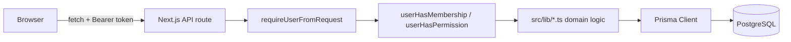

# Architecture

## Stack
- **Framework**: Next.js 14.2 (Pages Router), TypeScript in strict mode.
- **Database**: PostgreSQL, accessed via Prisma 5 (schema in [prisma/schema.prisma](../prisma/schema.prisma)).
- **Auth**: Email/password with bcrypt hashing; JSON Web Tokens issued on
  login and sent as `Authorization: Bearer <token>` on every API request.
  There is no session cookie — the frontend stores the token in memory /
  localStorage via `src/lib/auth-context.tsx` and attaches it via
  `authHeaders()`.
- **Testing**: Vitest for unit tests (`npx vitest run`); no browser/e2e
  test runner is configured yet.
- **Styling**: Tailwind CSS utility classes throughout; no CSS-in-JS.

## Request flow

Every API route under `src/pages/api/**` follows the same shape:
1. Verify the method.
2. `requireUserFromRequest(req)` — decodes the Bearer token, loads the `User`.
3. `userHasMembership(user.id, organizationId)` (or `userHasPermission`
   for the small set of permission-gated actions — see
   [permissions-matrix.md](permissions-matrix.md)) — every organization-scoped
   query is filtered by `organizationId`, which is the tenant-isolation
   boundary (see [security-notes.md](security-notes.md)).
4. Delegate to a `src/lib/*.ts` module for actual business logic (ledger
   posting, totals, validation) so the same logic is reusable and unit
   testable outside of the HTTP layer.
5. Return JSON.

## Domain modules (`src/lib/`)
| Module | Responsibility |
|---|---|
| `ledger.ts` | Double-entry validation, journal posting primitives |
| `money.ts` | Minor-unit (cents) arithmetic to avoid floating-point errors |
| `invoicing.ts` / `purchasing.ts` | AR/AP totals, posting, payments, void/reversal |
| `inventory.ts` | Average-cost stock movements |
| `payroll.ts` | Pay run ledger posting (accounting impact only) |
| `reconcile-utils.ts` | Bank transaction matching (Jaccard similarity, date proximity) |
| `entitlements.ts` / `plans.ts` | Plan/add-on feature gating |
| `approvals.ts` | Pending-action approval gate (see below) |
| `notifications.ts` | In-app notification creation/read state |
| `documents.ts` | File attachment storage (local disk) |
| `currency.ts` | Manual exchange-rate lookup/conversion |
| `dimensions.ts` | Department/location/program tagging on manual journal entries |
| `contractors.ts` | 1099 contractor directory + year-to-date spend |
| `nonprofit.ts` | Fund/grant tracking |
| `import-export.ts` | CSV import (dry-run + commit) and export |
| `webhooks.ts` | Outbound webhook subscription + signed delivery logging |

## The approval ("pending action") pattern
Some actions (currently: bill payments ≥ $500 — see
`APPROVAL_THRESHOLDS` in `src/lib/approvals.ts`) must be approved before
they take effect. Rather than adding a `status` field to every domain
model that might need gating, an `Approval` row stores the action's
parameters in a `payload` JSON column. Nothing is created until a
privileged user approves it, at which point a `resourceType`-keyed
executor performs the action for the first time
(`executeApprovedAction` in `src/lib/approvals.ts`). This keeps the
gating logic in one place and lets more `resourceType`s be added later
without further schema migrations.

## Frontend structure
- `src/pages/**` — one file per route (Pages Router), each wrapped in
  `<ProtectedRoute>` for authenticated pages.
- `src/components/AppShell.tsx` — sidebar/topbar layout, nav items gated
  by plan entitlements, global command bar (`CommandBar.tsx`) and
  notification bell (`NotificationBell.tsx`).
- `src/lib/auth-context.tsx` — React context holding the current user,
  token and selected organization; `authHeaders(token)` is used on every
  authenticated fetch.

## Multi-tenancy
Every domain table has an `organization_id` (or is reachable through one)
and every query is filtered by it after a membership check. There is no
row-level security at the database layer — isolation is enforced entirely
in the application layer. See [security-notes.md](security-notes.md) for
the implications of that choice.
